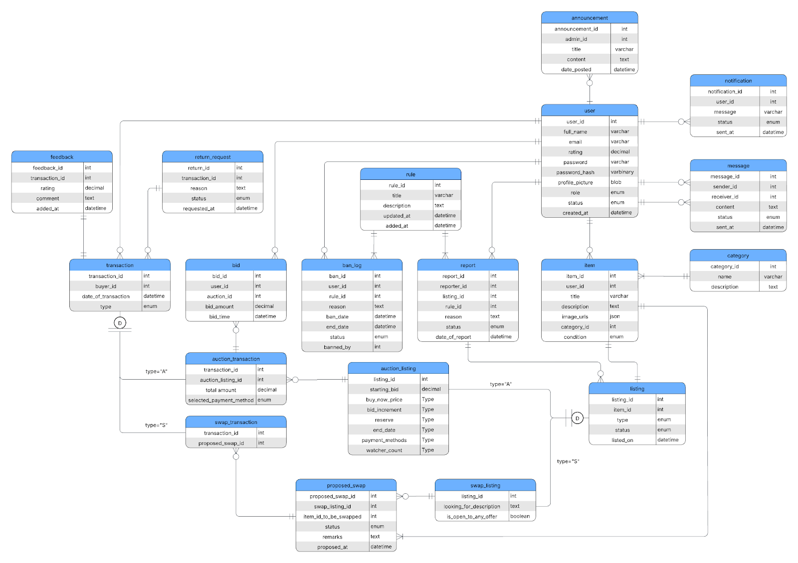
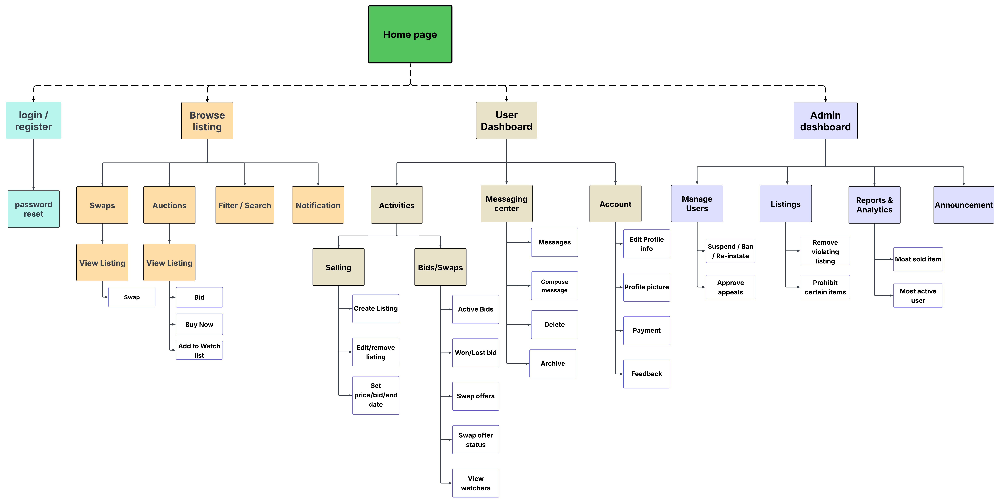
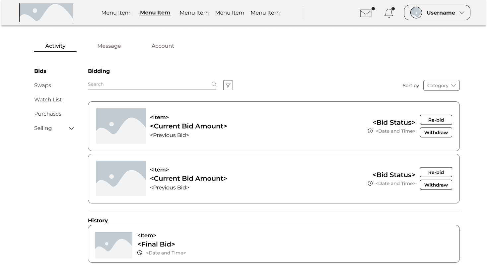

# System Analysis & Design Portfolio

**Aldyn Zandrex Lawagan** _Aspiring System Analyst & CS Student_ Aldyn Zandrex Lawagan | www.linkedin.com/in/lawagan

## Featured Project: SAMCIS BID AND SWAP SYSTEM

### 1. Project Overview

Create a website for students of SAMCIS where they can bid and swap there items. It provides a
safe and organized space where students can trade, buy, bid on items they need such as books,
uniforms, gadgets and school supplies

### 2. System Architecture (MVC)

We utilized the **Model-View-Controller (MVC)** pattern to separate concerns and ensure the system is scalable.

- **Model:** Handled data logic and database interactions using MySQL.
- **View:** Designed the user interface using [e.g., Java Swing / HTML / JSP / CSS].
- **Controller:** Managed the business logic, acting as the bridge between the user inputs and data updates.

### 3. System Artifacts & Diagrams

_As a System Analyst, I focused heavily on the planning phase to ensure data integrity._

#### **A. Entity Relationship Diagram (ERD)**

mapped the relationships between different entities.

#### **B. Site Map**

To provide search engine crawlers with a list of all important pages, including information like when they were last uploaded

#### **C. User Interface (Wireframes/Screenshots)**

